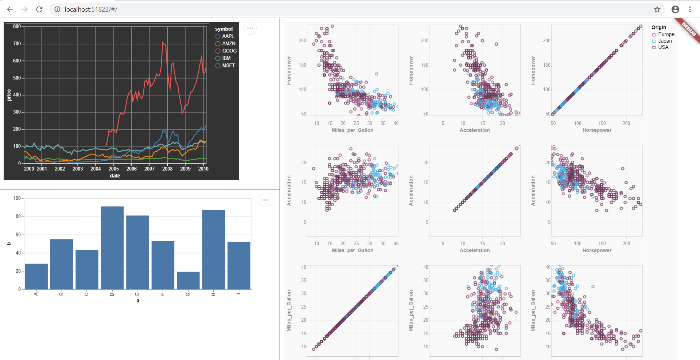
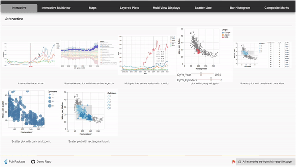
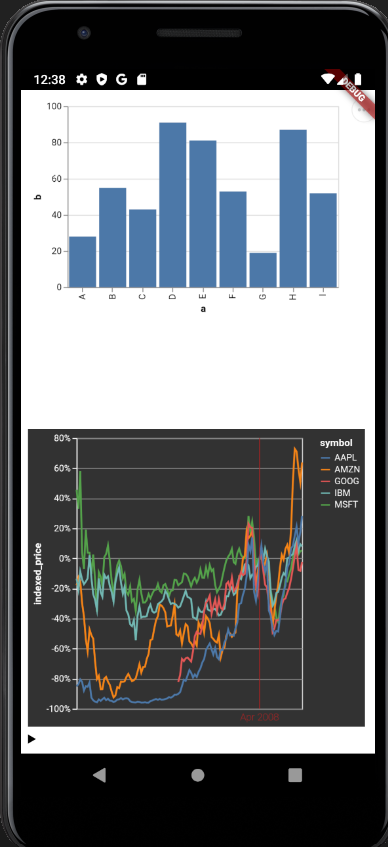

[](https://pub.dev/packages/vega_embed_flutter)

# vega_embed_flutter

A Flutter widget to embed vega-lite charts to flutter web and flutter apps using webview_flutter. Works consistently in Flutter web as of now. SInternally it uses vega-embed js library to embed these specs using JS interops and `HTMLElementView`. 

A Demo page with examples for different vega-embed options is available below.

https://abhilash-chandran.github.io/vega_embed_flutter/

[](https://abhilash-chandran.github.io/vega_embed_flutter/)

A full fledged demo page with various charts utilizing this package is avalaible [here](https://abhilash-chandran.github.io/vega_embed_flutter_demo_page/#/)

[](https://abhilash-chandran.github.io/vega_embed_flutter_demo_page/#/)

> Since flutter web_view is still in developer preview, vega_embed_flutter's web_view support should also be considered as a developer preview.

# Credits

This widget is made possible only because of the great works done by the team behind [vega-embed](https://github.com/vega/vega-embed), [vega-Lite](https://vega.github.io/vega-lite/) and [vega](https://vega.github.io/vega/). For a detailed documentation of how visualize using Vega-lite specs please head to their [doumentation](https://vega.github.io/vega-lite/docs/) page.

# General Setup Steps for flutter web

## Import Vega related Javascript files.

Start by adding the `script` tag for vega related java script files. For example.

**Index.html**

```
<!DOCTYPE html>
<html>
  <head>
    <meta charset="UTF-8" />
    <script src="https://cdn.jsdelivr.net/npm/vega@5"></script>
    <script src="https://cdn.jsdelivr.net/npm/vega-lite@4"></script>
    <script src="https://cdn.jsdelivr.net/npm/vega-embed@6"></script>
    <title>vega_flutter</title>
  </head>
  <body>
    <script src="main.dart.js" type="application/javascript"></script>
  </body>
</html>
```

## Add your vega lite specification files

Vega-Lite and Vega defines its visualsation in the form of json file. So for you project it would be easy to maintain all this vega-lite spec files in a folder say _vega_lite_specs_ folder. For example

```
$Project_root\vega_lite_specs
              |_ bart_chart.json
              |_ interactive_multiline_plot.json
              |_ interactive_splom.json
```

## Add assets entry in pupspec.yaml

In order for the web build to pick up the json schemas add it your `pubspec.yaml`. For e.g.

```
flutter:
  uses-material-design: true
  # This line includes all the files these directories during the build process
  # and placess them under build/web/assets folder.
  assets:
    - vega_lite_specs/
```

## Import the file and use the widget

Just import the `vega_embed_flutter` library as below

`import 'package:vega_embed_flutter/vega_embed_flutter.dart';`

Create a normal stateless/ful widget and use it as a normal stateless/ful widget.

```
class BarChart extends StatelessWidget {
  @override
  Widget build(BuildContext context) {
    return VegaLiteEmbedder(
      viewFactoryId: 'MyBarChart',
      vegaLiteSpecLocation: '/assets/vega_lite_specs/bar_chart.json',
    );
  }
}
```

# General set for normal flutter app

Follow the [Add your vega lite schema files](https://pub.dev/packages/vega_embed_flutter#add-your-vega-lite-schema-files) section and [Add assets entry in pupspec.yaml](https://pub.dev/packages/vega_embed_flutter#add-assets-entry-in-pupspecyaml) as mentioned above.

## Import web view specific file and use the widget

Import the vega embed view specific librarys as below
`import 'package:vega_embed_flutter/vega_embed_webview.dart';`

Create a normal stateless/ful widget and use it as a normal stateless/ful widget.

```
class ExampleWebViewApp extends StatelessWidget {
  @override
  Widget build(BuildContext context) {
    return MaterialApp(
      home: SafeArea(
        child: Center(
          child: Column(
            children: [
              Expanded(
                child: VegaLiteWebViewEmbedder(
                  vegaLiteSpecLocation: 'vega_lite_specs/bar_chart copy.json',
                ),
              ),
              Expanded(
                child: VegaLiteWebViewEmbedder(
                  vegaLiteSpecLocation:
                      'vega_lite_specs/interactive_index_chart.vl.json',
                  vegaEmbedOptions: VegaEmbedOptions(theme: 'dark'),
                ),
              ),
            ],
          ),
        ),
      ),
    );
  }
}
```

# VegaEmbed Options [WIP](available only for web)

Following vega-embed options are tested and are available as part of demo page. If you need further comprehensive options to be tested or enabled please do raise and issue so that I can spend time on options which are necessary.

For a detailed description of what each vega embed options check this page.
https://github.com/vega/vega-embed#options

|  Embed Options   |      Working       |                                                                                                  Comments                                                                                                  |
| :--------------: | :----------------: | :--------------------------------------------------------------------------------------------------------------------------------------------------------------------------------------------------------: |
|       mode       |   :construction:   |                                                                                          Avialble but not tested.                                                                                          |
|      theme       |       :100:        | Check [here](https://github.com/vega/vega-themes#included-themes) for detials on the themes. Valid values are [excel, ggplot2, quartz, vox, fivethirtyeight , dark, latimes, urbaninstitute, googlecharts] |
|   defaultStyle   | :heavy_check_mark: |                                                                                                                                                                                                            |
|     renderer     | :heavy_check_mark: |                                                                                                                                                                                                            |
|     logLevel     |   :construction:   |                                                                                                                                                                                                            |
|     tooltip      |     :thinking:     |                                                                                         Let me know if you need it                                                                                         |
|      loader      |        :x:         |                                                                                                                                                                                                            |
|      patch       |        :x:         |                                                                                                                                                                                                            |
|      width       | :heavy_check_mark: |                                                                          Note: :warning: width mentioned in spec overrides this.                                                                           |
|      height      | :heavy_check_mark: |                                                                          Note: :warning: Height mentioned in spec overrides this.                                                                          |
|     padding      | :heavy_check_mark: |                                                                                                                                                                                                            |
|     actions      |   :construction:   |                                                            Note: :warning: an example is shown to remove actions. But its not complete to spec.                                                            |
|   scaleFactor    | :heavy_check_mark: |                                                                     Note: This is a scale factor for the exported file, not the plot.                                                                      |
|      config      |     :thinking:     |                                                         Let me know if you need it. Porting config object to dart will take lot of effort to test.                                                         |
|    editorUrl     |   :construction:   |                                                                                          Avialble but not tested.                                                                                          |
|   sourceHeader   |   :construction:   |                                                                                          Avialble but not tested.                                                                                          |
|   sourceFooter   |   :construction:   |                                                                                          Avialble but not tested.                                                                                          |
|      hover       |     :thinking:     |                                                                                        Let me know if you need it.                                                                                         |
|       i18n       | :heavy_check_mark: |                                                                                                                                                                                                            |
| downloadFileName | :heavy_check_mark: |                                                                                                                                                                                                            |
|   formatLocale   |   :construction:   |                                                                                          Avialble but not tested.                                                                                          |
| timeFormatLocale |   :construction:   |                                                                                          Avialble but not tested.                                                                                          |

#### Any kind of code, idea, suggestions are welcome. Please check the repository and file your feedbacks and bugs which is highly appreciated.
