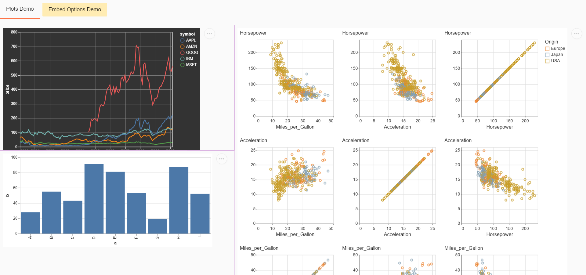

# vega_embed_flutter

A Flutter widget to embed vega-lite charts to flutter web. Works only in Flutter web as of now. Internall it uses vega-embed js library to embed these specs using JS interops and `HTMLElementView`. Here is an example chart rendered using this package.



A full fledged demo page with various charts utilizing this package is avalaible [here](https://abhilash-chandran.github.io/vega_embed_flutter_demo_page/#/)


For a simple example check the examples section.

# Credits

This widget is made possible only because of the great works done by the team behind [vega-embed](https://github.com/vega/vega-embed), [vega-Lite](https://vega.github.io/vega-lite/) and [vega](https://vega.github.io/vega/). For a detailed documentation of how visualize using Vega-lite specs please head to their [doumentaition](https://vega.github.io/vega-lite/docs/) page.

# General Setup Steps

## Import Vega related Javascript files.

Start by adding the `script` tag for vega related java script files. For example.

**Index.html**

```
<!DOCTYPE html>
<html>
  <head>
    <meta charset="UTF-8" />
    <script src="https://cdn.jsdelivr.net/npm/vega@5"></script>
    <script src="https://cdn.jsdelivr.net/npm/vega-lite@4"></script>
    <script src="https://cdn.jsdelivr.net/npm/vega-embed@6"></script>
    <title>vega_flutter</title>
  </head>
  <body>
    <script src="main.dart.js" type="application/javascript"></script>
  </body>
</html>
```

## Add your vega lite schema files

Vega-Lite and Vega defines its visualsation in the form of json file. So for you project it would be easy to maintain all this vega-lite spec files in a folder say _vega_lite_specs_ folder. For example

```
$Project_root\vega_lite_specs
              |_ bart_chart.json
              |_ interactive_multiline_plot.json
              |_ interactive_splom.json
```

## Add assets entry in pupspec.yaml

In order for the web build to pick up the json schemas add it your `pubspec.yaml`. For e.g.

```
flutter:
  uses-material-design: true
  # This line includes all the files these directories during the build process
  # and placess them under build/web/assets folder.
  assets:
    - vega_lite_specs/
```

## Import the file and use the widget

Just import the `vega_embed_flutter` library as below

`import 'package:vega_embed_flutter/vega_embed_flutter.dart';`

Create a normal stateless/ful widget and use it as a normal stateless/ful widget.

```
class BarChart extends StatelessWidget {
  @override
  Widget build(BuildContext context) {
    return VegaLiteEmbedder(
      viewFactoryId: 'MyBarChart',
      vegaLiteSpecLocation: '/assets/vega_lite_specs/bar_chart.json',
    );
  }
}
```

# VegaEmbed Options [WIP]

Some of the VegaEmbed option like default theming is already working. Remaining option will be tested and documented as and when this package progresses.

#### Any kind of code, idea, suggestions are welcome. Please check the repository and file your feedbacks and bugs which is highly appreciated.
