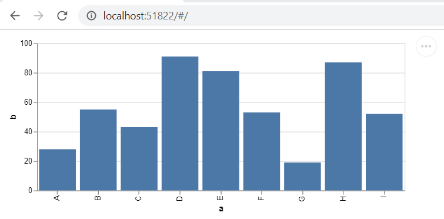

# Examples from the Repo

This is an example flutter web app which renders multiple vega-lite specs in one page using column and row arrangements.

## Running the example from the repo.

The below can be run by changin into the example folder and running for web using the following commands.

```text
$> git clone https://github.com/Abhilash-Chandran/vega_embed_flutter.git
$> cd vega_embed_flutter/example
$> flutter run -d chrome
```

This will run the availale example and open a browser with the predefined charts embeded using `VegaLiteEmbedde` widget.

## Result of repo example.

The example from the repo showcase multiple charts being laid out in a single page with different default theming options provided by the vega-embed project.


# Getting started with your own chart

This instructions assumes user has enable flutter-web config essential for flutter web development. If not please check this [get-started](https://flutter.dev/docs/get-started/web) page.

1. Create directory for your project say 'vega_embed_test'
2. Create a flutter-web project using `flutter create .` command.
3. Edit your `pubspec.yaml` file to install the `vega_embed_flutter` package.
   - e.g. add `vega_embed_flutter: ^0.1.0` to the dependecies

## Import Vega related Javascript files.

Start by adding the `script` tag for vega related java script files. For example.

**Index.html**

```
<!DOCTYPE html>
<html>
  <head>
    <meta charset="UTF-8" />
    <script src="https://cdn.jsdelivr.net/npm/vega@5"></script>
    <script src="https://cdn.jsdelivr.net/npm/vega-lite@4"></script>
    <script src="https://cdn.jsdelivr.net/npm/vega-embed@6"></script>
    <title>vega_flutter</title>
  </head>
  <body>
    <script src="main.dart.js" type="application/javascript"></script>
  </body>
</html>
```

## Creating vega-lite spec json file

For example here we can create `bar-chart.vl.json` file under the directory _vega_lite_specs_ as shown below.

```
 vega*lite_specs
       |_>  bar-charts.vl.json
       |_>  another-chart.vl.json
```

## Add contents to bar-charts.vl.json

Following is a simple bar chart with embeded data.

```json
{
  "$schema": "https://vega.github.io/schema/vega-lite/v4.json",
  "description": "A simple bar chart with embedded data.",
  "width": 500,
  "data": {
    "values": [
      { "a": "A", "b": 28 },
      { "a": "B", "b": 55 },
      { "a": "C", "b": 43 },
      { "a": "D", "b": 91 },
      { "a": "E", "b": 81 },
      { "a": "F", "b": 53 },
      { "a": "G", "b": 19 },
      { "a": "H", "b": 87 },
      { "a": "I", "b": 52 }
    ]
  },
  "mark": "bar",
  "encoding": {
    "x": { "field": "a", "type": "ordinal" },
    "y": { "field": "b", "type": "quantitative" }
  }
}
```

Ther are extension in VS-Code for visualizing the vega-lite specs in VS code itself. Also additional online editors are availblable for this. Check this [vega-lite ecosystem](https://vega.github.io/vega-lite/ecosystem.html) page. This can act as a quick prototype before rendering it as a flutter widget.

## Add the assets in pubspec.yaml

In order to access the above created json as an asset, it must added to the `pubspec.yaml` as folows.

```yaml
flutter:
  assets:
    - vega_lite_specs/ # Note: adds all the specs in this directory but not folders.
    - other_image_assets/
    - miscelaneous_js/custom.js
```

## Use the VegaLiteEmbedder widget

Create a stateless/ful widget and use the `VegaLitEmbder` widget as shown below. // Note that assets are to be accessed from "/assets" folder. Vega-embed resolves this json as a relative URL say 'http://domain:port/mycustompage/assets/vega_lite_specs/bar_chart.json'.

Also the `viewFactoryId` attribute should be unique across multiple `VegaLiteEmbedder` widget. This is a requirement from `HTMLElementView` widget which is internally used by this embedder widget.

```dart
import 'package:vega_embed_flutter/vega_embed_flutter.dart';

/// A simple bar chart with inline data.
class BarChart extends StatelessWidget {
  @override
  Widget build(BuildContext context) {
    return VegaLiteEmbedder(
      viewFactoryId: 'MyBarChart',
      vegaLiteSpecLocation: '/assets/vega_lite_specs/bar_chart.json',
    );
  }
}
```

## Edit you main.dart

In your `main.dart` file include this new `BarChart` widget as part of other widgets.
Thats it. Then run your application `flutter run -d web`.

```dart
import 'package:flutter/material.dart';
import 'package:vega_embed_flutter/vega_embed_flutter.dart';

void main() => runApp(MyApp());

class MyApp extends StatelessWidget {
  @override
  Widget build(BuildContext context) {
    return MaterialApp(
      title: 'Flutter Vega=embed demo',
      theme: ThemeData(
        primarySwatch: Colors.blue,
      ),
      home: MyPage(),
    );
  }
}

class MyPage extends StatelessWidget {
  const MyPage({
    Key key,
  }) : super(key: key);

  @override
  Widget build(BuildContext context) {
    return BarChart();
  }
}

class BarChart extends StatelessWidget {
  @override
  Widget build(BuildContext context) {
    return VegaLiteEmbedder(
      viewFactoryId: 'MyBarChart',
      vegaLiteSpecLocation: '/assets/vega_lite_specs/bar_chart.json',
    );
  }
}
```

## example output

When you run this project you should get an ouput like this.



## Theming

Vega-embed comes with some basic set of default themes which can be used like for example 'dark', 'ggplot2' etc. A full set of predefined themes can be found here [Vage-Themes](https://github.com/vega/vega-themes#included-themes).

`VegaLiteEmbedder` widget comes with an option where you can enable this themes. for example following bar chart renders in dark mode.

```dart
import 'package:vega_embed_flutter/vega_embed_flutter.dart';

/// A simple bar chart with dark theme.
class BarChart extends StatelessWidget {
  @override
  Widget build(BuildContext context) {
    return VegaLiteEmbedder(
      viewFactoryId: 'MyBarChart',
      vegaLiteSpecLocation: '/assets/vega_lite_specs/bar_chart.json',
      vegaOptions: VegaEmbedOptions()..theme = 'dark',
    );
  }
}
```

Here is how the output looks like


